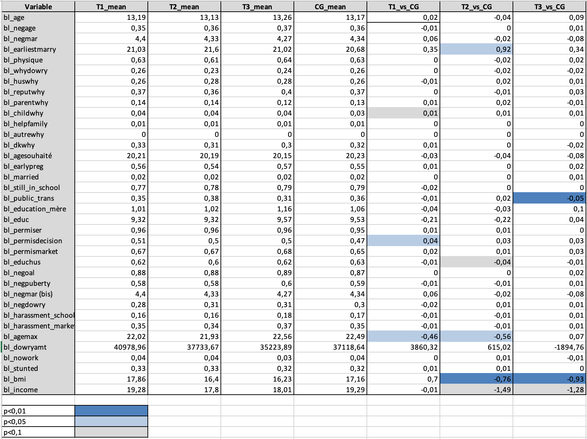
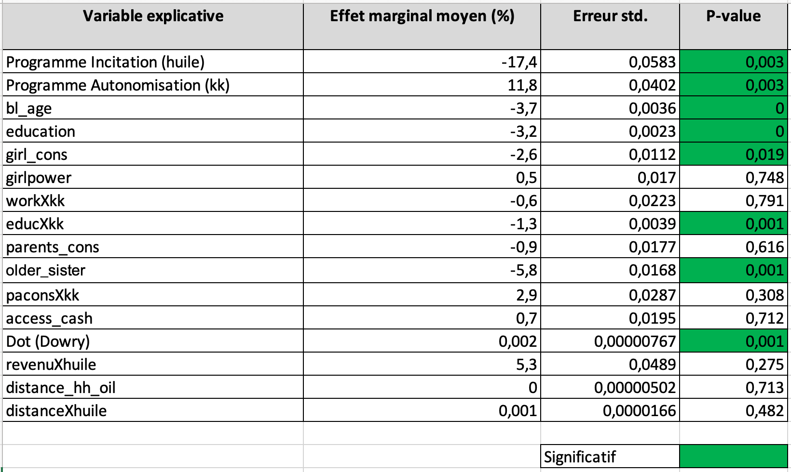
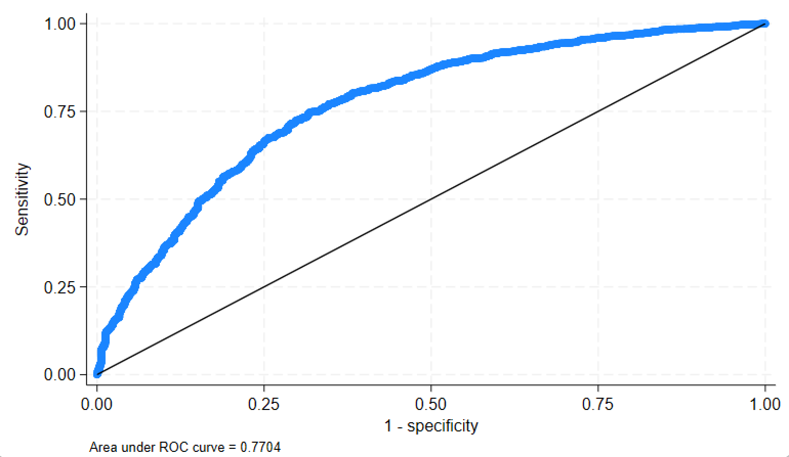

# Évaluation d'impact : programmes de lutte contre le mariage précoce au Bangladesh

*Impact evaluation (Stata) of a randomized controlled trial on child marriage prevention programs in rural Bangladesh — Probit model, marginal effects, and OLS robustness check. English summary below.*

Projet réalisé en binôme avec **Melike Demiray**, sous la direction de Mme
Marine De Talance, dans le cadre du Master Data Analyst (IAE Paris-Est,
Université Gustave Eiffel).

## Problématique

Quel est l'impact des programmes d'incitation conditionnelle,
d'autonomisation des adolescentes, et de leur combinaison, sur la
probabilité qu'une fille se marie avant l'âge de 18 ans au Bangladesh ?

## Contexte et données

L'analyse s'appuie sur les données d'une expérimentation contrôlée
randomisée (RCT) menée entre 2007 et 2017 dans 460 communautés rurales du
centre-sud du Bangladesh, en partenariat avec l'ONG Save the Children —
l'étude *"Financial Incentives and an Adolescent Empowerment Program to
Reduce Child Marriage in Rural Bangladesh"* (Buchmann, Field, Glennerster,
Nazneen et al. ; voir notamment le rapport
[3ie Impact Evaluation Report 68](https://www.3ieimpact.org/sites/default/files/2019-01/IE%2068-Bangladesh-marriage.pdf)
et la fiche [J-PAL](https://www.povertyactionlab.org/evaluation/financial-incentives-and-adolescent-empowerment-program-reduce-child-marriage-rural)).
Les communautés sont réparties aléatoirement entre quatre groupes :
incitation conditionnelle seule (huile de cuisson, 77 communautés),
autonomisation seule (programme Kishoree Kontha, 153 communautés),
programme combiné (77 communautés), et groupe témoin (153 communautés).
L'échantillon final comprend 13 811 filles suivies sur deux vagues
d'enquête (baseline 2007, endline ~2012).

Les données utilisées pour ce projet ont été fournies dans le cadre du
cours ; le script suppose un fichier déjà chargé dans Stata (`use ...`),
non inclus ici — voir les sources ci-dessus pour la documentation
complète de l'étude d'origine.

## Démarche

1. **Tests d'équilibre** — comparaison des quatre groupes à la baseline
   pour vérifier la validité de la randomisation (t-tests par variable)
2. **Modèle Probit par blocs** — régression naïve puis ajout progressif de
   blocs de contrôles (caractéristiques individuelles, familiales,
   financières, géographiques) pour isoler l'effet propre des traitements
3. **Effets marginaux moyens (APE)** — interprétation des coefficients du
   Probit en points de pourcentage de probabilité
4. **Diagnostics du modèle** — pseudo-R² de McFadden, test du rapport de
   vraisemblance, matrice de confusion (seuil optimisé par l'indice de
   Youden), courbe ROC
5. **Robustesse** — régression linéaire complémentaire sur l'âge au
   mariage (variable continue), comparée aux résultats du Probit

## Résultats clés

Les tests d'équilibre confirment une bonne comparabilité initiale des
groupes (quelques écarts ponctuels, cohérents avec une randomisation
correcte sur 460 communautés) :



Le programme d'incitation conditionnelle (distribution d'huile) réduit
significativement la probabilité de mariage avant 18 ans de 17,4 points
de pourcentage (p = 0,003). À l'inverse, le programme d'autonomisation
seul est associé à une hausse de 11,8 points — un résultat contre-intuitif
discuté dans le rapport. L'âge, l'éducation et la présence d'une sœur
aînée jouent aussi un rôle significatif :



Le modèle Probit complet obtient un pseudo-R² de McFadden de 0,161 et une
aire sous la courbe ROC de 0,770, indiquant une bonne capacité de
discrimination :



La régression linéaire complémentaire sur l'âge au mariage confirme la
cohérence du résultat principal : le programme d'incitation retarde l'âge
au mariage d'environ 0,72 an en moyenne (p < 0,01), tandis que le
programme d'autonomisation seul n'a pas d'effet significatif.

## Stack technique

Stata — `probit`, `margins`, `estat classification`, `lroc`, `reg`,
`ttest`, `estpost`/`esttab` (package `estout`).

## Structure du dépôt

```
├── script/
│   └── evaluation_impact.do
├── report/
│   └── evaluation_d_impact.pdf
└── images/
```

---

## English summary

This project (paired coursework with Melike Demiray) evaluates the impact
of a conditional cash-like incentive and an adolescent empowerment program
on child marriage in rural Bangladesh, using data from a well-documented
cluster-randomized trial run with Save the Children (Buchmann, Field,
Glennerster, Nazneen et al.; see the 3ie and J-PAL links above for the
original study). After confirming baseline balance across the four
treatment arms, a Probit model is built incrementally across blocks of
controls to isolate the effect of each intervention, interpreted through
average marginal effects and validated with McFadden's pseudo-R²,
a likelihood-ratio test, a Youden-optimized confusion matrix, and an ROC
curve (AUC = 0.77). A complementary OLS model on the continuous marriage
age confirms the main result: the conditional incentive program
significantly reduces the probability of child marriage, while the
empowerment program alone shows no significant — and at times
counter-intuitive — effect.
